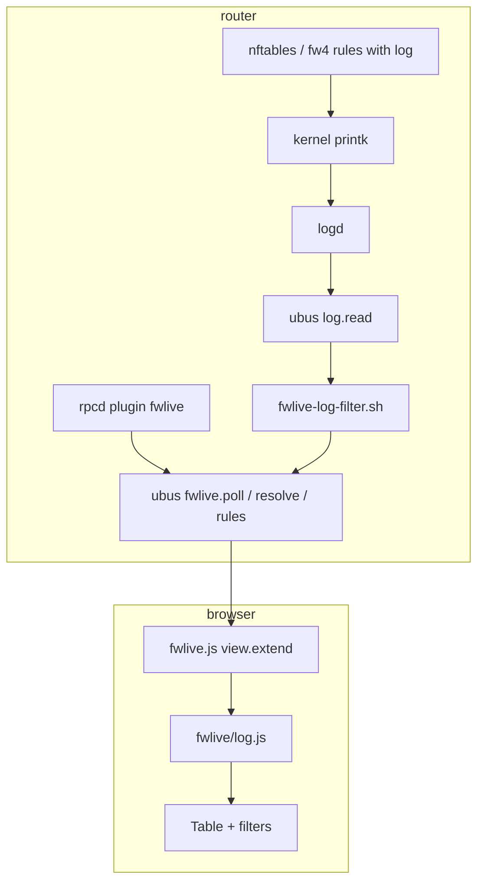

# Architecture

`luci-app-fwlive` is a **pure client-side LuCI JavaScript application**. No Lua CBI views. No custom log daemon.

## Data path

**Fixed constraint:** we read what logd already captured. We do not tap netfilter directly.

## Module split

| Module | Location | Responsibility |
|--------|----------|----------------|
| **View shell** | `htdocs/.../view/status/fwlive.js` | Layout, fetch/render handlers, pause/limit, DOM, click-to-filter |
| **Poll coordinator** | `htdocs/.../fwlive/poll-coordinator.js` | Request serialization, epochs, visibility subscription, cadence registration, and terminal disposal |
| **Render policy** | `htdocs/.../fwlive/render-policy.js` | Pure weak-device display-cap and render-cost decisions |
| **Render scheduler** | `htdocs/.../fwlive/render-scheduler.js` | Epoch-safe frame coalescing and render token-bucket state; invokes the view's paint callback |
| **Log brain** | `htdocs/.../fwlive/log.js` | `isFirewallEvent`, `normalizeEntry`, filters, display helpers (classify from `CLASSIFY_SPEC`) |
| **Test twin / SoT** | `core/fwlive-log.js` | Editable source of truth + CLI; `CLASSIFY_SPEC` drives classify |
| **Shell classifier** | `root/usr/libexec/fwlive-is-firewall-event.sh` | **Generated** from `CLASSIFY_SPEC` via `gen-shell-classifier.js` (committed; SDK does not run Node) |
| **Rule map** | `root/usr/libexec/rpcd/fwlive` | `rules`, `poll` (filtered log), `resolve` (reverse DNS), `logging_status`, `enable_wan_logging`, `disable_wan_logging` |
| **WAN logging** | `root/usr/libexec/fwlive-logging.sh` | WAN zone `log=1` helpers (sourced by rpcd) |
| **Log filter** | `root/usr/libexec/fwlive-log-filter.sh` | Shell `isFirewallEvent` parity before JSON leaves router |
| **Menu / ACL** | `root/usr/share/luci/menu.d`, `rpcd/acl.d` | `admin/status/fwlive`, read `fwlive.*` only (no session `log.read`) + write enable/disable |

### Poll lifecycle ownership

The view creates one coordinator with a request runner, poll and visibility
adapters, a visibility reader, and the initial cadence from `constants.js`.
`startPolling()` subscribes to visibility and registers the timer once; it does
not fetch. The view resolves RPC preferences before starting the coordinator
and requesting the first batch. Filter widgets still restore in `addFooter`.

`requestPoll()` returns a promise for the requested batch. Calls during an
active batch share one pending batch, which reads current preferences when it
starts. Hidden calls are no-ops; a pending batch survives hidden completion
until the visible catch-up. The active batch remains owned until the runner
settles, even when its epoch has become stale.

The coordinator owns all mutable scheduling state. `getState()` returns a
snapshot without exposing promises, resolvers, or timer callbacks. The view
reads the epoch through `currentPollEpoch()` before applying replies or queued
frames. RTT classification stays with the view's transport health handling;
it requests cadence changes through `setCadence()`, which only updates timer
registration. Repeated startup and unchanged cadence are idempotent.

The view owns the `pagehide` listener. A persisted `pagehide` enters the
browser back/forward cache, so the listener leaves the coordinator attached;
the browser suspends the page and the existing visibility subscription resumes
normal polling when the page returns. A non-persisted `pagehide` calls
`disposeView()` to remove the listener, clear its filter timer, invalidate
hostname work, and dispose the poll coordinator and render scheduler.

Disposal is terminal: it invalidates the epoch, removes polling and visibility
subscriptions, and settles both batches without aborting the RPC. Late replies
and callbacks cannot revive it. The terminal `viewDisposed` flag also makes
late startup completion skip its first poll and makes post-disposal `render()`
and `addFooter()` no-ops. Keep the disposed instance attached to the departing
view so old epochs cannot become current again.

The render scheduler owns queued frame intent, its token bucket, and the last
painted row count/head identity. `schedule(force)` coalesces requests within a
poll epoch; a newer request behind a stale frame gets a fresh frame. Coalesced
force survives requeue so display changes such as resolved names still paint; it
expires when the request paints or is discarded. `shouldRender()` reserves
budget using the pure render-cost policy, and the view calls `markRendered()`
only after painting.

The buffer application produces `lastBatchNewIdCount`; the view passes it to
the scheduler as the budget input. The scheduler neither fetches nor owns rows.
Limit changes reset the budget and reserve force for the next scheduled paint,
so new rows need not wait for hostname resolution. `forceNextRender()` returns
a cancellation function for that reservation alone; refresh completion cannot
clear force already queued or a newer reservation. Disposal cancels queued work
and rejects later paints. DOM construction, scroll position, and banner text stay in the view.

## Design choices

| Choice | Rationale |
|--------|-----------|
| Poll `fwlive.poll` (~1s) | Wraps `log.read` + server firewall filter; line count in `addresses[0]` |
| ACL omits `log.read` | Session callers use `fwlive.poll` only; the rpcd plugin invokes `ubus call log read` as root |
| Client-side normalize/filter | Normalization stays in JS; `isFirewallEvent` retained as safety net |
| Enable/disable concurrency | No confirm dialog / no flock — low multi-admin risk; UI uses `loggingBusy`; concurrent toggles are last-writer-wins |
| Parser disagreement | After poll, the client re-applies `isFirewallEvent`; **client wins** (drops lines the shell kept if heuristics disagree) |
| MAC redaction | Client display only (`formatMessageDisplay` strips `MAC=…`, including message `title`); poll JSON may still contain MACs on the wire |
| Output encoding | Renderers must emit untrusted values as text nodes; server map keys are additionally gated by `is_uci_style_name` — [Security model § Invariants](security-model.md#invariants) |
| Log filter injection | `fwlive-log-filter.sh` feeds messages as data through jsonfilter/awk stdin — not a shell-injection surface |
| Log content is untrusted | Every parsed field is attacker-influenced regardless of who wrote the firewall rule — [Security model § Untrusted input inventory](security-model.md#untrusted-input-inventory) |
| Opt-in hostnames | `fwlive.resolve` via BusyBox `nslookup`; checkbox default off; server checks the IPv4/IPv6 shape before lookup |
| `core/` + LuCI mirror | Parser tested without browser or router |
| LuCI gate (not generator) | `gen-luci-wrapper.js` checks full `CLASSIFY_SPEC` equality + preserve markers; shared classify in `log.js` stays hand-maintained (no text-transform codegen). Core has no `@fwlive-codegen:luci-begin/end` markers — only LuCI has a preserve region for presentation helpers. |
| nft/fw4 primary | Tested on **21.02.7** (fw3 lab), **22.03.7**, **23.05.5**, **24.10.8**, **25.12.5** lab matrix |
| iptables LOG | Primary on **21.02.x** (fw3); best-effort on **22.03+** when nft absent — same logd pipe; rule map from `iptables-save` |
| OPNsense as reference | Interaction and layout patterns, not PHP/Volt port |
| Keep monorepo + `src-link` | See [Feed layout decision](#feed-layout-decision) |

## Feed layout decision

**Do not** split `openwrt-feed/` into a submodule or feed-only source repo unless external builders demand `src-git` and that friction is real.

| Question | Answer |
|----------|--------|
| Premature? | **Yes** — ship surface is ~11 files; monorepo bulk is docs/tests/tooling |
| Helps build/ship? | **No** — Releases + binary feed + `src-link` already cover it |
| Helps OpenWrt/LuCI upstream? | **No** — upstream wants a PR into `luci/applications/`, not a third-party feed repo |
| When to revisit | Many external image builders need `src-git`, or we grow multiple packages needing a stable feed root |

When cutting an upstream PR, keep the monorepo feed Makefile include as `$(TOPDIR)/feeds/luci/luci.mk`; rewrite to `include ../../luci.mk` only in the copied tree under `luci/applications/`. See [upstream-openwrt.md](upstream-openwrt.md).

Related: [`../github-publish-checklist.md`](../github-publish-checklist.md) (distribution), [`../../feeds.conf.example`](../../feeds.conf.example).

## Normalized event schema

Each log line becomes a row with stable fields (`timestamp`, `action`, `src`, `dst`, `interface_in`, `rule_hint`, …). Full spec: [`../openwrt-fwlive-schema.md`](../openwrt-fwlive-schema.md).

## UI parity scope

What we match vs defer vs OPNsense Live View: [`../opnsense-liveview-parity.md`](../opnsense-liveview-parity.md).

Visual target: [`../fwlive-ui-design-target.md`](../fwlive-ui-design-target.md).

## Package layout

See [`../../openwrt-feed/luci-app-fwlive/README.md`](../../openwrt-feed/luci-app-fwlive/README.md).
