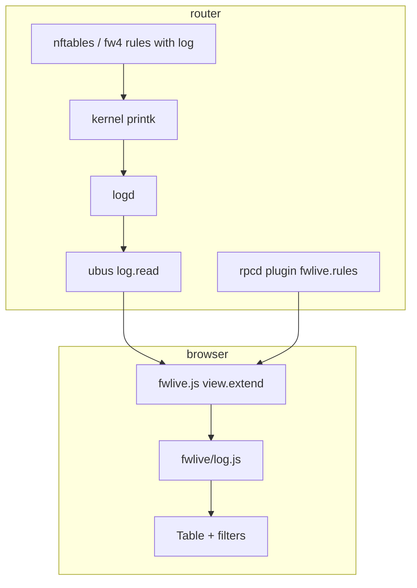

# Architecture

`luci-app-fwlive` is a **pure client-side LuCI JavaScript application**. No Lua CBI views. No custom log daemon.

## Data path

**Fixed constraint:** we read what logd already captured. We do not tap netfilter directly.

## Module split

| Module | Location | Responsibility |
|--------|----------|----------------|
| **View shell** | `htdocs/.../view/status/fwlive.js` | Layout, 1s poll, pause/limit, DOM, click-to-filter |
| **Log brain** | `htdocs/.../fwlive/log.js` | `isFirewallEvent`, `normalizeEntry`, filters, display helpers |
| **Test twin** | `core/fwlive-log.js` | Same logic for Node tests + CLI (`fwlive-test.sh`) |
| **Rule map** | `root/usr/libexec/rpcd/fwlive` | Parse `nft` ruleset → hint → UCI name JSON |
| **Menu / ACL** | `root/usr/share/luci/menu.d`, `rpcd/acl.d` | `admin/status/fwlive`, `log.read`, `fwlive.rules` |

## Design choices

| Choice | Rationale |
|--------|-----------|
| Poll `log.read` (~1s) | Matches OPNsense default UX; works on all supported OpenWrt versions |
| Client-side filter | No server template engine; shareable URL hash state |
| `core/` + LuCI mirror | Parser tested without browser or router |
| nft/fw4 only | Menu depends on `/usr/sbin/nft`; fw3 not supported |
| OPNsense as reference | Interaction and layout patterns, not PHP/Volt port |

## Normalized event schema

Each log line becomes a row with stable fields (`timestamp`, `action`, `src`, `dst`, `interface_in`, `rule_hint`, …). Full spec: [`../openwrt-fwlive-schema.md`](../openwrt-fwlive-schema.md).

## UI parity scope

What we match vs defer vs OPNsense Live View: [`../opnsense-liveview-parity.md`](../opnsense-liveview-parity.md).

Visual target: [`../fwlive-ui-design-target.md`](../fwlive-ui-design-target.md).

## Package layout

See [`../../openwrt-feed/luci-app-fwlive/README.md`](../../openwrt-feed/luci-app-fwlive/README.md).
