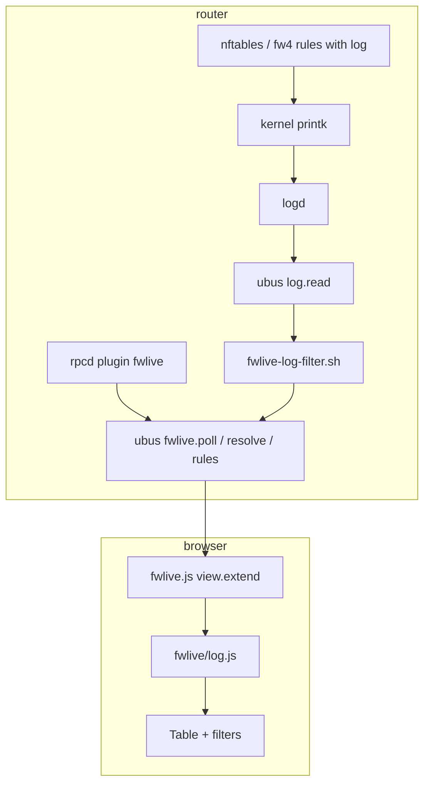

# Architecture

`luci-app-fwlive` is a **pure client-side LuCI JavaScript application**. No Lua CBI views. No custom log daemon.

## Data path

**Fixed constraint:** we read what logd already captured. We do not tap netfilter directly.

## Module split

| Module | Location | Responsibility |
|--------|----------|----------------|
| **View shell** | `htdocs/.../view/status/fwlive.js` | Layout, 1s poll, pause/limit, DOM, click-to-filter |
| **Log brain** | `htdocs/.../fwlive/log.js` | `isFirewallEvent`, `normalizeEntry`, filters, display helpers |
| **Test twin** | `core/fwlive-log.js` | Same logic for Node tests + CLI (`fwlive-test.sh`) |
| **Rule map** | `root/usr/libexec/rpcd/fwlive` | `rules`, `poll` (filtered log), `resolve` (reverse DNS) |
| **Log filter** | `root/usr/libexec/fwlive-log-filter.sh` | Shell `isFirewallEvent` parity before JSON leaves router |
| **Menu / ACL** | `root/usr/share/luci/menu.d`, `rpcd/acl.d` | `admin/status/fwlive`, `fwlive.rules/poll/resolve` |

## Design choices

| Choice | Rationale |
|--------|-----------|
| Poll `fwlive.poll` (~1s) | Wraps `log.read` + server firewall filter; line count in `addresses[0]` |
| Client-side normalize/filter | Normalization stays in JS; `isFirewallEvent` retained as safety net |
| Opt-in hostnames | `fwlive.resolve` via `getent`; checkbox default off |
| `core/` + LuCI mirror | Parser tested without browser or router |
| nft/fw4 primary | Validated on 23.05 / 24.10 / 25.12 lab matrix |
| iptables LOG best-effort | Same logd pipe; rule map from `iptables-save`; UI label `iptables` vs `fw4` — not sign-off required |
| OPNsense as reference | Interaction and layout patterns, not PHP/Volt port |

## Normalized event schema

Each log line becomes a row with stable fields (`timestamp`, `action`, `src`, `dst`, `interface_in`, `rule_hint`, …). Full spec: [`../openwrt-fwlive-schema.md`](../openwrt-fwlive-schema.md).

## UI parity scope

What we match vs defer vs OPNsense Live View: [`../opnsense-liveview-parity.md`](../opnsense-liveview-parity.md).

Visual target: [`../fwlive-ui-design-target.md`](../fwlive-ui-design-target.md).

## Package layout

See [`../../openwrt-feed/luci-app-fwlive/README.md`](../../openwrt-feed/luci-app-fwlive/README.md).
