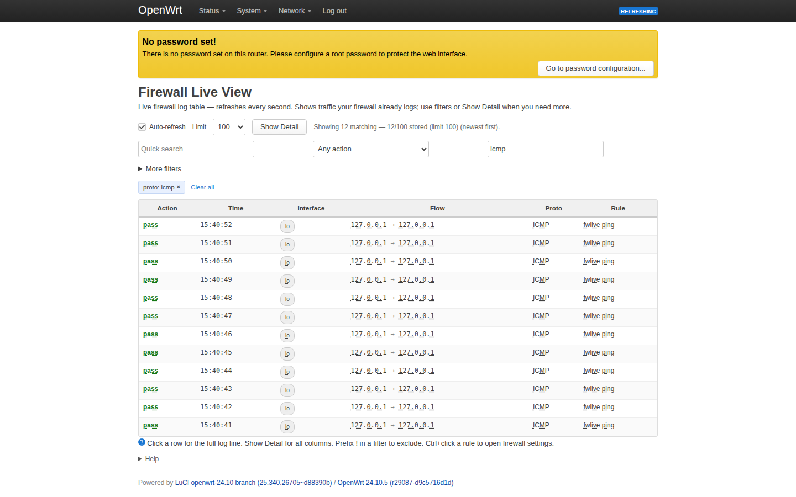
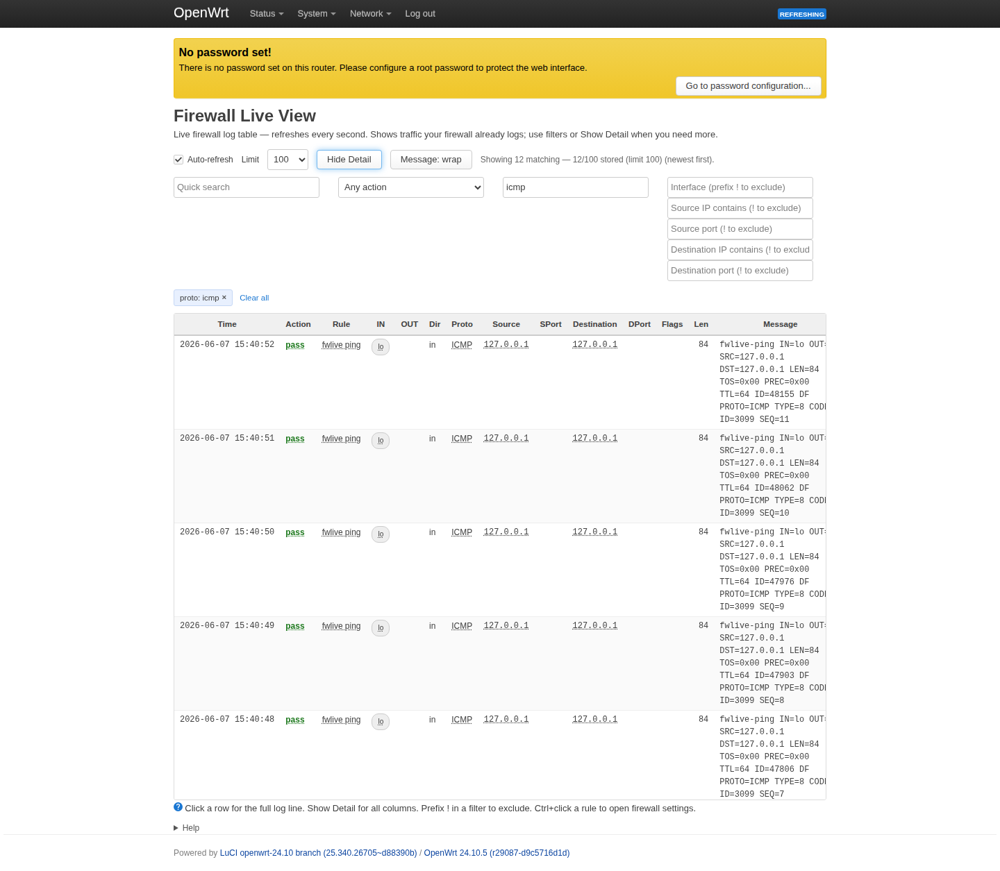
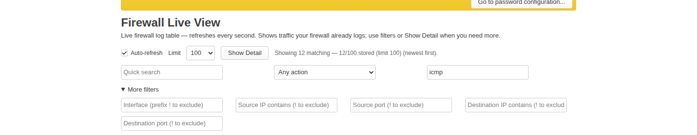
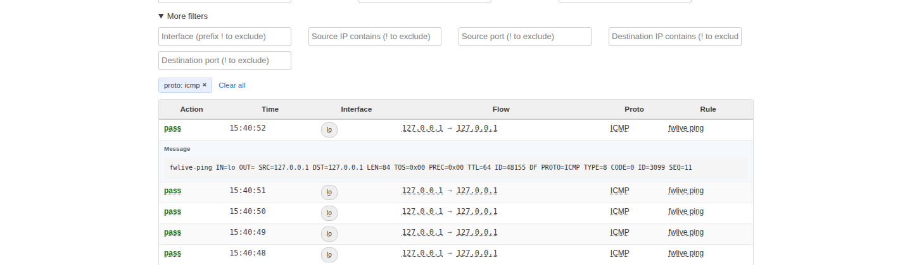

# User guide — Firewall Live View

Documentation for **installing and using** `luci-app-fwlive` on an OpenWrt router.

| Guide | What you'll learn |
|-------|-------------------|
| [Overview](overview.md) | What the package does and when to use it |
| [Requirements](requirements.md) | Supported OpenWrt versions and dependencies |
| [Installation](installation.md) | Install from feed, SDK build, or `.ipk` / `.apk` |
| [Using the UI](using-the-ui.md) | Simple & Detailed views, Show Detail toggle, Help |
| [Enabling firewall logs](enabling-firewall-logs.md) | Make traffic appear in the view |

**Menu path after install:** **Status → Firewall Live View**  
(`http://<router>/cgi-bin/luci/admin/status/fwlive`)

---

## Screenshots (from QEMU lab)

| Simple (default) | Detailed (Show Detail) |
|------------------|------------------------|
|  |  |

| Filters | Expanded message (Simple) |
|---------|---------------------------|
|  |  |

Recapture: [assets/capture-screenshots.md](assets/capture-screenshots.md)

---

## Developer?

Building, testing, or contributing: **[Developer documentation](../developer/README.md)**.
