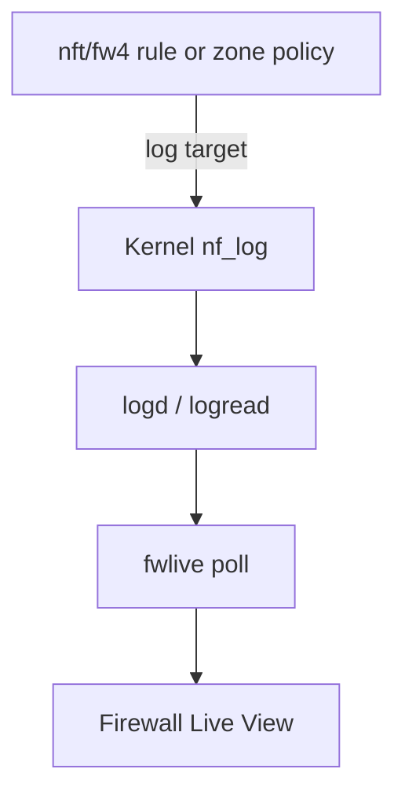

# Enabling firewall logs

Firewall Live View shows traffic only when **nftables / fw4** writes firewall-shaped lines to **logd**. The UI reads those lines — it does not tap the firewall directly.

**After a fresh install the table is usually empty.** Stock OpenWrt rarely logs traffic until you turn logging on. The fastest path is the **Enable logging** button on **Status → Firewall Live View** (same as WAN zone logging in **Network → Firewall**). This guide also covers shell setup, logging more traffic, and troubleshooting.

---

## Quick start after install

### Option A — LuCI button (recommended)

1. Open **Status → Firewall Live View**.
2. If the table is empty, click **Enable logging**.
3. Wait for blocked inbound WAN traffic (background scans, rejected probes). Normal LAN browsing is **not** logged.

Use **Disable logging** in the toolbar to turn WAN zone logging off again. Rate limiting uses the OpenWrt default (`10/minute`) unless you already set `log_limit` on the WAN zone.

### Option B — shell (SSH or System → Terminal)

#### 1. Confirm kernel logging works

`nft log` needs netfilter log modules. On minimal images they may be missing — logging fails silently without them.

```sh
# Should print nf_log_ipv4 (IPv4) and nf_log_ipv6 (IPv6), not "none"
cat /proc/sys/net/netfilter/nf_log/2
cat /proc/sys/net/netfilter/nf_log/10
```

If either shows **`none`** or the path is missing, install the kmods (package names vary slightly by release):

```sh
opkg update
opkg install kmod-nf-log-ipv4 kmod-nf-log-ipv6 2>/dev/null \
  || opkg install kmod-nf-log kmod-nf-log6
/etc/init.d/firewall reload
```

#### 2. Enable WAN zone logging (rejected / dropped inbound)

This is the fastest way to see **real** traffic without a synthetic ping test. fw4 adds log rules for **rejected and dropped** packets on that zone (not every accepted packet).

```sh
WAN=$(uci -q show firewall | sed -n "s/^firewall\.\(@zone\[[0-9]*\]\)\.name='wan'$/\1/p" | head -1)
if [ -z "$WAN" ]; then
  echo "WAN zone not found in /etc/config/firewall" >&2
  exit 1
fi
uci set "firewall.${WAN}.log=1"
uci commit firewall
/etc/init.d/firewall reload
echo "Enabled zone logging on firewall.${WAN}"
```

OpenWrt applies the default **`log_limit`** (`10/minute`) when the option is not set in UCI.

Generate traffic: from the internet, probe the router WAN (or wait for background scans). From LAN, browse the web — that traffic is **accepted** and will **not** appear until you add rule-level or forward logging (below).

Verify logs before opening Live View:

```sh
logread | tail -20 | grep -E 'SRC=|reject wan|DROP|REJECT'
```

Open **Status → Firewall Live View**. Filter **Action → drop** or search for `reject wan` in the quick search.

To turn zone logging off later:

```sh
uci delete "firewall.${WAN}.log"
uci commit firewall
/etc/init.d/firewall reload
```

#### 3. Optional — confirm the UI with a ping (synthetic pass events)

Useful when WAN is quiet or you want a guaranteed **pass** row:

```sh
nft insert rule inet fw4 input ip protocol icmp icmp type echo-request \
  log prefix "fwlive-ping " accept
ping -c 3 127.0.0.1
logread | grep fwlive-ping
```

Remove when finished:

```sh
nft -a list chain inet fw4 input | grep fwlive-ping
nft delete rule inet fw4 input handle <handle>
```

---

## What shows up without extra configuration?

| Traffic | Visible on stock image? | How to enable |
|---------|-------------------------|---------------|
| WAN inbound **drop / reject** (scans, blocked ports) | No — until zone **`log`** | [Quick start §2](#2-enable-wan-zone-logging-rejected--dropped-inbound) |
| LAN → WAN **accepted** browsing | No | Rule **`log`** or temporary forward **`log`** rule |
| Forwarded guest / VLAN **reject** | No — until that zone **`log`** | `option log '1'` on the guest zone |
| Hits on a **specific** firewall rule | No — until that rule logs | `option log '1'` on the `@rule` |
| Invalid / malformed packets | No — unless **`drop_invalid`** + logging | See [defaults](#defaults-and-invalid-packets) |

The Live View empty-state hint about “default WAN drops” means traffic **after you enable zone logging**, not on a untouched factory config.

---

## Three layers of logging



1. **Kernel (`nf_log`)** — modules must be loaded (`kmod-nf-log-*`). Without them, rules can match but **`logread` stays empty**.
2. **Zone policy (`option log`)** — fw4 logs **rejected and dropped** traffic for that zone, rate-limited by **`log_limit`**.
3. **Rule policy (`option log '1'`)** — logs hits on **that** UCI rule (port forward, guest block, etc.).

You combine layers: zone logging for background WAN noise; rule logging when debugging one policy.

---

## Zone logging (drops and rejects)

Per-zone options in **`/etc/config/firewall`**:

| Option | Purpose |
|--------|---------|
| **`log`** | `1` = log rejected/dropped filter traffic for this zone |
| **`log_limit`** | Rate cap (default **`10/minute`** on OpenWrt) — always set this on busy zones |

Example — log drops on a **guest** zone as well as WAN:

```sh
# Replace @zone[N] with your guest zone section from: uci show firewall | grep name
uci set firewall.@zone[2].log='1'
uci set firewall.@zone[2].log_limit='20/minute'
uci commit firewall
/etc/init.d/firewall reload
```

LuCI: **Network → Firewall → Zones → Edit zone → Logging**.

Log lines often use prefixes like **`reject wan in:`** — filter on those in Live View or use **Action → drop**.

---

## Rule-level logging (specific policies)

Add logging to the **one rule** you are debugging via UCI or LuCI.

```sh
# Example: log a named port-forward rule (adjust @rule[N] — uci show firewall | grep name)
uci set firewall.@rule[10].log='1'
uci commit firewall
/etc/init.d/firewall reload
```

In **`/etc/config/firewall`**:

```
config rule
	option name 'Allow-SSH-WAN'
	option src 'wan'
	option dest_port '22'
	option target 'ACCEPT'
	option log '1'
```

**Production tips:**

- Log **accept** on the rule you care about (did the packet match?).
- Log **drop/reject** on deny rules (why was it blocked?).
- Use **`option limit`** on hot rules if fw4 supports it on your release.
- Prefer **`log prefix "my-rule "`** via **`/etc/nftables.d/`** snippets when you need a clear **Rule** column label.

---

## Log more traffic (forwarding, accepts, custom chains)

Zone logging does **not** show every **accepted** LAN→WAN session. For that you need explicit **`log`** on nft rules.

### Temporary — observe forwarded traffic (rate-limited)

**Non-terminating** `log` in nftables: the packet keeps traversing the chain. Always use a **limit** on busy chains.

```sh
# Log up to ~30 forwarded packets per minute, then remove when done
nft insert rule inet fw4 forward limit rate 30/minute log prefix "fwlive-fwd "
```

Generate traffic from LAN (browse, ping 8.8.8.8). Filter quick search: `fwlive-fwd`.

Remove:

```sh
nft -a list chain inet fw4 forward | grep fwlive-fwd
nft delete rule inet fw4 forward handle <handle>
```

### Temporary — log everything on **input** (lab only)

```sh
nft insert rule inet fw4 input limit rate 30/minute log prefix "fwlive-in "
```

**Caution:** verbose logging fills **logd** quickly on production routers. Use **`log_limit`** on zones and **`limit rate`** on nft rules. Pause Live View or narrow filters if the table floods.

### Custom chains

Rules in **`/etc/nftables.d/`** or **`/etc/firewall.user`** must include **`log`** (and usually a **`prefix`**) themselves — fwlive only displays what those rules emit. See the [full reference](../fwlive-nft-logging.md#fw4--uci-persistent) for **`include`** / **`chain-pre`** examples.

---

## Defaults and invalid packets

In **`config defaults`**:

| Option | Effect |
|--------|--------|
| **`drop_invalid`** | Drop packets not matching conntrack / invalid state |
| **`log`** (zone-level, not defaults) | — |

Invalid drops are only visible if the **zone** or **rule** that drops them also **logs**. There is no separate global “log all invalid” sysctl — it is still **`log`** on the nft rule fw4 generates.

---

## Verify before blaming the UI

```sh
logread | grep -E 'SRC=|DST=|PROTO=' | tail
ubus call fwlive poll '{"addresses":["20"]}' | head -c 500
```

If **`logread`** has firewall lines but Live View does not, check LuCI login and that **`luci-app-fwlive`** is installed. If **`logread`** is empty, fix logging on the router first — the UI cannot invent events.

Common pitfalls:

- **`nft add`** at the **end** of **`input`** — LAN traffic jumps to **`input_lan`** first. Use **`nft insert`** at the top for tests.
- **Loopback ping** (`127.0.0.1`) may bypass your rule — ping the router’s LAN IP from another host.
- Avoid **`:`** inside **`log prefix`** on the shell; use a trailing space (`"fwlive-ping "`) or an **`nft -f`** heredoc.

---

## Lab helper (QEMU / SSH from a PC)

From a machine that can SSH to the router:

```sh
./scripts/fwlive-nft-ping-log.sh add --ssh
ssh root@192.168.1.1 'ping -c 5 127.0.0.1'
```

---

## iptables / fw3 (21.02.x primary; best-effort on 22.03+)

On **21.02.x** (fw3), iptables LOG is the normal path. On **22.03+**, iptables is unusual (most images use nft) — same enablement either way. Enable **`LOG`** on the rules you care about — same logd pipeline, not TRACE:

```sh
iptables -I INPUT -p icmp --icmp-type echo-request \
  -j LOG --log-prefix "fwlive-ping: "
iptables -I INPUT -p icmp --icmp-type echo-request -j ACCEPT
```

Verify with `logread | grep fwlive-ping`. LuCI shows a short **`iptables`** backend label when detected.

Details: **[`../fwlive-iptables-logging.md`](../fwlive-iptables-logging.md)**

---

## Full reference

Advanced scenarios, Docker lab caveats, IPv6, and parser details: **[`../fwlive-nft-logging.md`](../fwlive-nft-logging.md)**
