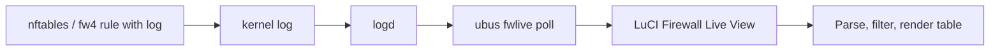

# What is Firewall Live View?

**Firewall Live View** is a LuCI page for OpenWrt that shows **live firewall log events** in a sortable, filterable table — similar in spirit to OPNsense’s Live View. On **22.03+** images it targets **nftables / firewall4**; on legacy **21.02.x** it uses **iptables LOG** (fw3).

## The problem it solves

On OpenWrt, firewall hits are written to the system log (`logread`). That stream mixes dnsmasq, procd, kernel noise, and firewall lines. Troubleshooting “why was this packet dropped?” usually means:

- SSH in and run `logread | grep …`
- Lose context when the terminal scrolls
- Repeat the same grep with different filters

Firewall Live View gives operators a **dedicated, always-on table** that:

- Refreshes about **once per second**
- Shows **only firewall-shaped lines**
- Highlights **pass** vs **drop** (and related actions)
- Supports **field filters**, quick search, and **click-to-filter**
- Resolves **rule names** where fw4/nft metadata allows
- Keeps filter state in the **URL hash** so you can bookmark or share a view

## What it is not

- Not a packet capture tool (use `tcpdump` for full payloads)
- Not a replacement for `nft list ruleset` — it shows **what already logged**
- Not tied to one router model — the package is architecture-independent (`_all` / LuCI JS)

## How data flows

`fwlive poll` wraps filtered `log.read` — only firewall-shaped lines are sent to the browser.

Live View shows **whatever OpenWrt is logging**. Stock configurations log almost nothing — use **Enable logging** once for WAN drops/rejects (same as **Network → Firewall**). See [Enabling firewall logs](enabling-firewall-logs.md) and [Using the UI → First visit](using-the-ui.md#first-visit).

## When to use it

| Scenario | Useful? |
|----------|---------|
| Debug a new port-forward or WAN rule | Yes — watch pass/drop in real time |
| Make sure that guest/Wi‑Fi isolation works | Yes — filter by interface and source |
| Audit intermittent drops | Yes — pause the table, adjust filters, resume |
| Long-term archival / compliance | No — use remote syslog or dedicated logging |

## Next steps

1. Check [Requirements](requirements.md)
2. [Install](installation.md) the package
3. [Enable logging](enabling-firewall-logs.md#option-a--luci-button-recommended) on **Status → Firewall Live View** (or use the shell quick start)
4. Open **Status → Firewall Live View** and read [Using the UI](using-the-ui.md)
