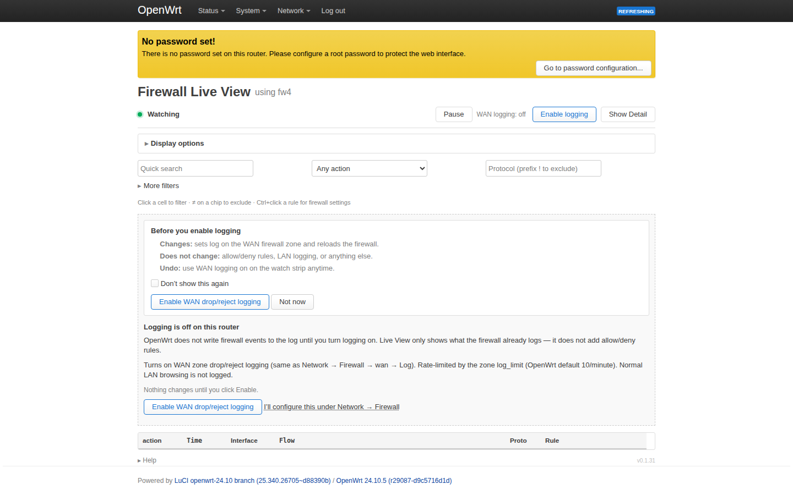
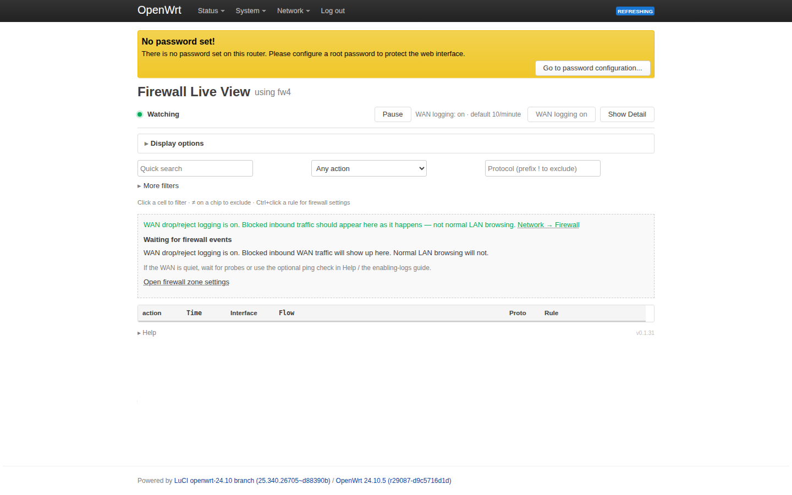

# Using the UI

Open **Status → Firewall Live View** in LuCI.

Live View shows **whatever OpenWrt is already logging**. Stock configurations log almost nothing — that is normal, not a broken install. Use **Enable logging** once for WAN drops/rejects (same as **Network → Firewall**). The app does not add allow/deny rules on its own.

On-page **Help** (collapsed at the bottom) covers the basics without leaving the router.

## First visit

### 1. Logging is off

1. **Title** — *Logging is off on this router* (cause first, not “broken table”).
2. **Before you enable logging** — one-time panel: what changes, what does not, how to undo.
3. **Enable WAN drop/reject logging** — intentional step; or pick **Not now**, or configure zones under **Network → Firewall** yourself.
4. Watch strip shows **WAN logging: off** and a short **Enable logging** button.

Nothing changes until you click Enable.

### 2. After you enable

1. Watch strip shows a single **WAN logging on · rate** control (click to disable).
2. A green notice shows that WAN drop/reject logging is on — not normal LAN browsing.
3. If the table is still empty, you are **waiting for firewall events** (quiet WAN). Blocked inbound traffic appears as it happens.

Optional synthetic check: [Enabling firewall logs → ping test](enabling-firewall-logs.md#2-optional--ping-test-synthetic-pass-events).

## Simple view (default)

1. **Title row** — **Firewall Live View** on the left; **Watching** status (dot + counts) on the right.
2. **Watch strip** — Pause/Resume, logging control, and segmented **Simple / Detail** and **Wrap / One line** groups.
3. **Display options bar** — **Limit**, **Row tint**, **Palette**, and **Show hostnames** on one line (no drawer).
4. **Filter row** — quick search, Action, and Protocol (grouped menu + optional custom type-in); open **More filters** for the rest.
5. **Table** — click a cell to filter; click a row body (not a filter link) to expand Message.

| Column | Meaning |
|--------|---------|
| **Action** | pass, drop, reject, etc. — color-coded |
| **Time** | Compact `HH:MM:SS` (today) |
| **Interface** | Ingress interface (badge) |
| **Flow** | `source:port → destination:port` — click parts to filter |
| **Proto** | TCP, UDP, ICMP, … |
| **Rule** | Resolved fw4/UCI name when possible |

**Expand raw message:** click any data row (not a filter link) to show or hide the full netfilter log line below that row.

1. Click the row body (for example the Action cell) to expand.
2. The full log line appears under that row — click again to collapse.

### Simple filters

Quick search, **Action**, and **Protocol** are always visible. Protocol offers common values in a menu; type in the adjacent field for anything else (prefix `!` to exclude). Open **More filters** for interface, source/destination, and ports.

1. Active filters appear as **chips** under the search bar.
2. Click **≠** on a chip to flip include ↔ exclude; **×** removes one; **Clear all** resets.
3. **More filters** reveals interface, addresses, and ports.

## Detailed view

Click **Detail** on the watch strip (the active segment is highlighted). Click **Simple** to return.

1. **Detail** switches to the forensic table and uses the full browser width (Simple keeps LuCI's normal column) — widen the window to see more per row.
2. Every normalized field is visible in one row (including Message).
3. **Wrap / One line** (next to Simple / Detail) applies in Detailed view only.

Shows every normalized field in one wide table:

Time, Action, Rule, IN, OUT, Dir, Proto, Source, SPort, Destination, DPort, Flags, Len, **Message**

Use Detailed when you need the raw `KEY=value` message inline without expanding rows, or when debugging flags, length, and direction fields.

## Shared controls

| Control | Behavior |
|---------|----------|
| **Pause / Resume** | Live updates run until you Pause. Resume continues the table. Polling never stops. |
| **Enable logging** | Filled button on the watch strip when WAN logging is off. Sets WAN zone drop/reject logging (same as Network → Firewall). No allow/deny rules are added. Concurrent toggles from multiple admins are last-writer-wins. Rate is the firewall `log_limit` (default `10/minute`), not a fwlive cap. |
| **WAN logging on · rate** | When logging is on, one merged control shows status and rate. Click it to disable. |
| **Simple / Detail** | Segmented pair on the watch strip. The active segment is highlighted. Preferences saved in `localStorage`. |
| **Wrap / One line** | Segmented pair next to Simple / Detail. Visible in Detailed view only. |
| **Display options** | Inline bar below the watch strip: **Limit**, **Row tint** (checkbox + palette), and **Show hostnames**. |
| **Limit** | Rows to keep (25 … 2000, default 100). Stored in the browser. |
| **Show hostnames** | Off by default. When checked, resolved names replace IPs in **Flow** and address columns. Hover shows the IP. Click still filters by IP. |
| **Quick search** | Matches across all normalized fields. |

## Filtering

- **Click any cell** (action, IP, protocol, interface, flow endpoint) to filter.
- Active filters appear as **chips** — click **≠** on a chip to flip include ↔ exclude; **×** removes one; **Clear all** resets.
- You can also prefix text filters with **`!`** for negation (same as **≠** on a chip).
- **URL hash** stores filters, limit, and `view=detailed` for shareable links.

### Filter tips

| Goal | Approach |
|------|------------|
| See only drops | Action → `drop` |
| Hide passes | Click **pass** in the table, then **≠** on the `action: pass` chip |
| One client | Click source in **Flow** or use **More filters → Source** |
| ICMP test | Protocol → `ICMP` after [enabling ping logging](enabling-firewall-logs.md) |

## Rule column

When fw4 logs a **prefix** (for example, `fwlive-ping` followed by a space), the UI shows a label. Ctrl+click (Cmd+click on macOS) a rule name to open the firewall configuration; plain click filters on that hint.

## Empty table

If no events appear after install, that is expected until logging is on — see [First visit](#first-visit). **Enable logging** sets WAN zone `log=1` (same as **Network → Firewall**). The empty state explains what will and will not appear (WAN drops/rejects, not normal LAN browsing).

If logging is already on but the table is still empty, wait for inbound WAN traffic or see **[Quick start — optional ping test](enabling-firewall-logs.md#2-optional--ping-test-synthetic-pass-events)**. Advanced setup: **[Enabling firewall logs](enabling-firewall-logs.md)**.

## High traffic rate

If more than ~250 **new** events arrive per second, a banner may appear and rendering throttles briefly.

## Related reading

- [Overview](overview.md)
- [Enabling firewall logs](enabling-firewall-logs.md)
